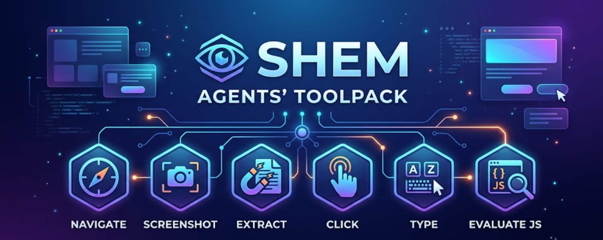

<p align="center">
  
</p>

<h1 align="center">Shem Browser Tools</h1>

<p align="center">
  A <a href="https://github.com/thephilip/shem">Shem</a> tool pack that gives LLM agents browser access — navigate, screenshot, extract text, click, type, run JavaScript, save PDFs, and manage tabs.
</p>

## Install

```bash
shem-install https://github.com/thephilip/shem-browser-tools
```

Or from a local path:

```bash
shem-install file:///path/to/shem-browser-tools
```

## Usage

A single `browser` tool dispatches by `action`. Each action runs identically in
headless and live-connect mode.

| Action | Parameters | Returns | Use case |
|---|---|---|---|
| **navigate** | `url` | page title, safe text, final URL | "Read the docs at example.com/docs" |
| **screenshot** | `selector` (opt) | base64 PNG | "Show me what this page looks like" or "capture the #results element" |
| **extract** | `selectors` (list) | text per selector | "Get all `h2` headlines and `.price` values" |
| **click** | `selector` | confirmation | "Click 'Accept Cookies'" or "click the 'Next' link" |
| **type** | `selector`, `text` | confirmation | "Fill 'myuser' into the username field" |
| **evaluate** | `script` | JS return value | "What's `document.title`?" or "Scrape JSON from a script tag" |
| **pdf** | `path` (opt) | file path | "Save this receipt as a PDF" |
| **list_tabs** | `connect_url` | tab list (id, title, url) | "What tabs are open?" |
| **switch_tab** | `tab_id`, `connect_url` | tab info | "Switch to tab 2" |

All actions accept an optional `connect_url` parameter. When provided, the tool
connects to a running browser via Playwright's CDP WebSocket endpoint. When
omitted, it launches a headless Firefox (configurable via
`SHEM_BROWSER_TYPE=chromium` or `webkit`).

**Scenarios:**

- **Read a page:** `navigate` → returns safe text, blocks prompt injection
- **Interact with a form:** `type` into inputs, `click` the submit button, then `navigate` to follow redirects
- **Debug a UI:** `screenshot` → base64 for visual inspection, `evaluate` to dump state
- **Scrape structured data:** `extract` with CSS selectors, or `evaluate` with JS for complex parsing
- **Live browser session:** `list_tabs` to discover tabs, `switch_tab` to move between them, all other actions work on the active tab

## Live-connect mode

To attach to a running browser over CDP:

1. Start your browser with remote debugging:
   - **Chrome/Chromium:** `google-chrome --remote-debugging-port=9222`
   - **Playwright's Chromium:** `~/.cache/ms-playwright/chromium-*/chrome-linux64/chrome --remote-debugging-port=9222`
   - **Firefox/Zen** do not support CDP; use headless mode instead.
2. Pass the WebSocket URL as `connect_url`:
   ```
   browser_list_tabs: list_tabs, connect_url: "ws://127.0.0.1:9222/..."
   ```

## Requirements

- **Python 3** with `playwright` installed: `pip install playwright && playwright install`
- **Podman or Docker** (recommended) for sandboxed execution. Falls back to host with a warning if neither is detected.

## Prompt Injection Defense

This pack integrates sanitization logic from [Sump](https://github.com/thephilip/sump) (Apache 2.0). All page text returned to the LLM is:

1. Stripped of invisible Unicode tag characters (`U+E0000–U+E007F`)
2. Scanned against known prompt injection patterns
3. Wrapped in `<untrusted>...</untrusted>` tags for non-whitelisted domains

Configure via `~/.config/shem/sump-config.json`:

```json
{
  "whitelist": ["docs.example.com"],
  "domains": ["pastebin.com"],
  "patterns": ["forget everything"]
}
```

## License

Apache 2.0 — see LICENSE and NOTICE.
